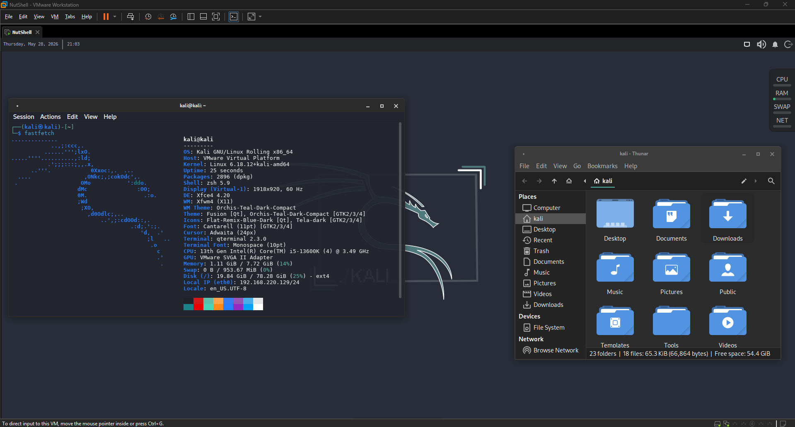

## KALI RICING
These are the essential rice I do to make my Kali more personalized to my taste. I like it, but it definitely has more room for improvement.

**1. Wallpaper**
* Move "kali-wallpaper-2.png" to "/usr/share/backgrounds/kali/"
* Desktop (Settings) > "Choose the wallpaper", also "Apply to all workspaces" if you want that.

**2. Restore Panel Backup**
* Download "Panel.tar.bz2"
* Panel Profiles > Import > Apply "Backup\_..."

**3. Use a GTK theme**
* Download and move "Orchis-Teal-Dark-Compact (GTK).tar.xz" to "/usr/share/themes/"
* Apperance > Style > Select "Orchis-Teal-Dark-Compact (GTK)"

**4. Use the icons for the GTK**
* Download and move "01-Tela.tar (icons).xz" to "/usr/share/icons/"
* Apperance > Icons > Select "Tela-dark (icons)"

**5. Add a GTK .css for the user**
* Download and move "gtk.css" to "~/.config/gtk-3.0/gtk.css"

**6. Edit a keyboard shortcut**
* Keyboard > Application Shortcuts > Select Command "xfce4-appfinder"
* Change it to "bash -c 'pgrep xfce4-appfinder && pkill xfce4-appfinder || xfce4-appfinder'"

**7. Configure Application Finder**
* Disable "Keep running instance in the background"
* Enable "Single-click selects and launches items"

**8. Add a xcape super key bind**
* Session and Startup > Application Autostart > Add
* Name "Xcape Super Key Bind 2", Description "Bind Super Key to Alt F3", Comamnd ""

**9. Configure Window Manager Tweaks**
* Disable "Show shadows under dock windows"

**10. Change fonts**
* Download and move "Inter (fonts).zip" and "JetBrainsMono-2.304 (fonts).zip" to "/usr/share/fonts/"
* Appearance > Fonts > Select "Inter Regular" as "Default Font" and "JetBrains Mono Medium" as "Default Monospace Font"
* Terminal settings > Select "JetBrains Mono" as "Font"

### Optionals
Didn't do any of these because it will consume a bit more resource which I don't want or it just doesn't fit with my current setup.

**1. Use powerlevel10k or spaceship framework**
* You can add the framework with themes to get a more appealing visual such as icons and more features

**2. Modify your fastfetch to make it pretty**
* Lots of people modify their fastfetch output to make it more aesthetic which you can do, but I don't because you'll only see it when someone asks for it or when your sharing your rice somewhere.

**3. Use a template for your terminal emulator**
* You can use more templates for the terminal UI which you get in the internet usually named like "\[FILENAME\].color.scheme"

